# System Architecture

**AlphaEarth Deforestation Early Warning System**

**Date**: October 2025
**Version**: 1.0
**Status**: ✅ Production-ready

---

## Table of Contents

1. [High-Level Architecture](#high-level-architecture)
2. [Data Flow Architecture](#data-flow-architecture)
3. [Feature Extraction Pipeline](#feature-extraction-pipeline)
4. [Model Architecture](#model-architecture)
5. [Production System Architecture](#production-system-architecture)
6. [Phase Progression (CRAWL → WALK → RUN)](#phase-progression)
7. [Component Interactions](#component-interactions)
8. [Deployment Architecture](#deployment-architecture)

---

## High-Level Architecture

### System Overview


### Key Components

| Component | Technology | Purpose | Status |
|-----------|-----------|---------|--------|
| **Model Service** | Python, XGBoost | Core prediction engine | ✅ Production |
| **Feature Extractor** | Python, Google Earth Engine | 70D feature generation | ✅ Production |
| **REST API** | FastAPI, Pydantic | Programmatic access | ✅ Production |
| **Dashboard** | Streamlit, Folium | Interactive UI | ✅ Production |
| **Explainer** | SHAP | Model interpretability | ✅ Production |

---

## Data Flow Architecture

### End-to-End Prediction Flow


### Caching Strategy


**Cache Keys**: MD5 hash of `(lat, lon, date, collection_name)`
**Cache Storage**: Local file system (data/cache/)
**Hit Rate**: ~85% for validation sets, ~40% for new locations

---

## Feature Extraction Pipeline

### 70D Feature Architecture

```mermaid
graph TB
    subgraph "Input"
        LOC[Location<br/>lat, lon, year]
    end

    subgraph "Annual Features (3D)"
        E1[AlphaEarth<br/>year-2]
        E2[AlphaEarth<br/>year-1]
        E3[AlphaEarth<br/>year]
        D1[delta_1yr<br/>norm of E3 - E2]
        D2[delta_2yr<br/>norm of E3 - E1]
        ACC[acceleration<br/>D1 - D2]
    end

    subgraph "Multiscale Features (66D)"
        COARSE[AlphaEarth Coarse<br/>1km radius]
        EMB64[Embeddings<br/>64D]
        HET[Heterogeneity<br/>std(embeddings)]
        RNG[Range<br/>max - min]
    end

    subgraph "Temporal Feature (1D)"
        YEAR[Normalized Year<br/>(year - 2020) / 4.0]
    end

    subgraph "Output"
        FEAT[70D Feature Vector]
    end

    LOC --> E1
    LOC --> E2
    LOC --> E3
    LOC --> COARSE

    E1 --> D2
    E2 --> D1
    E3 --> D1
    E3 --> D2

    D1 --> ACC
    D2 --> ACC

    COARSE --> EMB64
    COARSE --> HET
    COARSE --> RNG

    LOC --> YEAR

    D1 --> FEAT
    D2 --> FEAT
    ACC --> FEAT
    EMB64 --> FEAT
    HET --> FEAT
    RNG --> FEAT
    YEAR --> FEAT

    style FEAT fill:#c8e6c9,stroke:#388e3c,stroke-width:3px
    style LOC fill:#e1f5ff
```

### Feature Importance Distribution


**Key Insights**:
- Annual deltas dominate (44% combined)
- Multiscale context critical (landscape fragmentation = 6%)
- Individual coarse embeddings less important than their aggregate

---

## Model Architecture

### XGBoost Pipeline


### Training Configuration


### SHAP Explanation Architecture


---

## Production System Architecture

### Service Layer Design


### API Endpoint Architecture


### Dashboard Page Architecture


---

## Phase Progression

### CRAWL → WALK → RUN Evolution

```mermaid
graph TB
    subgraph "CRAWL Phase: Validation"
        C1[Single Location Test<br/>Proof of Concept]
        C2[Multi-Location Test<br/>Statistical Significance]
        C3[Temporal Sensitivity<br/>Early Warning Feasibility]
        C4[Geographic Test<br/>Generalization Check]
        CD[Decision:<br/>Proceed to WALK?]
    end

    subgraph "WALK Phase: Development"
        W1[Annual Features<br/>3D Deltas]
        W2[Hard Validation Sets<br/>Honest Evaluation]
        W3[Multiscale Embeddings<br/>+7 AUROC points]
        W4[Spatial CV<br/>Prevent Leakage]
        W5[Production Model<br/>0.913 AUROC]
        WD[Decision:<br/>Ready for Production?]
    end

    subgraph "RUN Phase: Deployment"
        R1[Model Service<br/>Inference Engine]
        R2[REST API<br/>FastAPI]
        R3[Dashboard<br/>Streamlit]
        R4[SHAP Explanations<br/>Interpretability]
        RD[Production:<br/>Ready for Users]
    end

    C1 --> C2
    C2 --> C3
    C3 --> C4
    C4 --> CD
    CD -->|✅ Yes| W1

    W1 --> W2
    W2 --> W3
    W3 --> W4
    W4 --> W5
    W5 --> WD
    WD -->|✅ Yes| R1

    R1 --> R2
    R2 --> R3
    R3 --> R4
    R4 --> RD

    style CD fill:#fff4e6,stroke:#ff6f00,stroke-width:2px
    style WD fill:#fff4e6,stroke:#ff6f00,stroke-width:2px
    style RD fill:#c8e6c9,stroke:#388e3c,stroke-width:3px
```



---

## Component Interactions

### Core Component Dependency Graph


### Data Dependency Graph


---

## Deployment Architecture

### Local Development Setup


### Production Deployment Options

#### Option 1: Docker Compose


#### Option 2: Cloud Deployment (AWS/GCP)


---

## Performance Characteristics

### Latency Breakdown


**Bottlenecks**:
1. **Feature Extraction (3s)**: Earth Engine API calls (3 annual + 1 coarse)
2. **SHAP Computation (2s)**: Tree traversal for all features
3. **Model Inference (<100ms)**: Fast (XGBoost optimized)

**Optimization Strategies**:
- ✅ **Caching**: Pre-extract embeddings (85% hit rate on validation)
- ✅ **Batching**: Group Earth Engine requests
- 🔮 **Future**: Async processing, Redis caching

---

## Summary

This architecture document provides multiple views of the system:

1. **High-Level**: User interfaces → Services → External APIs
2. **Data Flow**: Request → Feature Extraction → Prediction → Explanation
3. **Feature Pipeline**: 70D feature composition and extraction
4. **Model Architecture**: XGBoost ensemble with SHAP
5. **Production System**: FastAPI + Streamlit deployment
6. **Phase Progression**: CRAWL → WALK → RUN evolution
7. **Component Interactions**: Dependency graph across all modules
8. **Deployment**: Local development and production options

**Key Architectural Decisions**:
- **Modular Design**: Clear separation between feature extraction, prediction, and explanation
- **Caching Strategy**: File-based caching for Earth Engine API calls
- **Multiple Interfaces**: REST API, Dashboard, Python SDK for different users
- **Interpretability First**: SHAP explanations integrated at architecture level
- **Spatial Validation**: Built into training pipeline to prevent leakage

**Production Status**: ✅ **READY**
- All components implemented and tested
- 0.913 AUROC on hard validation sets
- <10s latency for single predictions
- Comprehensive documentation

---

**Related Documents**:
- Learning Journey: `learning_journey_crawl_to_run.md`
- User Guide: `run_phase_user_guide.md`
- Cleanup Summary: `repository_cleanup_summary.md`

**Last Updated**: 2025-10-24
**Version**: 1.0
